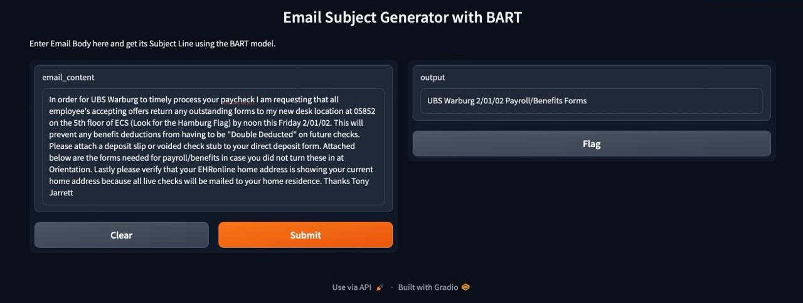

# Email Subject Line Generation using BART 

This repository features a project for an email subject line generation tool powered by a fine-tuned BART model. Designed to enhance email marketing effectiveness, the model is trained and deployed on Google Colab, utilizing free resources for training and inference. Deployment is streamlined through a Gradio API, offering an intuitive interface for crafting engaging subject lines.

## Table of Contents
- [Project Overview](#project-overview)
- [Features](#features)
- [Installation](#installation)
- [Usage](#usage)
  - [Training the BART Model](#training-the-BART-model)
  - [Deploying the Model with Gradio](#deploying-the-model-with-gradio)
- [Metrics](#metrics)
- [Outcomes](#outcomes)
- [Customization](#customization)
- [Contributing](#contributing)
- [License](#license)

## Project Overview
This project involves two key components:
1. **Model Objective**: This model involves identifying the most salient sentences from the email body, and abstracting the message contained in those sentences into only a few words. 
2. **Gradio Deployment**: The model is deployed using the Gradio API, providing a user-friendly web interface where users can input Email Body and get accurate respective Subjects for that Email Body.

## Features
- **Fine-tuned BART model** for AI-related Email subject line generation tasks.
- **Colab-based Training**: Model is trained using free resources on Google Colab, enabling easy reproducibility.
- **Gradio Web Interface**: An interactive front-end interface for real-time model inference.
- **Lightweight Deployment**: Model inference is also done on Google Colab, making deployment cost-effective and scalable.

## Installation

1. **Clone the repository**:
   ```bash
   git clone https://github.com/Kethavardhan/AI-Based-Generative-QA-System/tree/master

   cd AI-Based-Generative-QA-System/Email-Subject-Generation/
2. **Requirements**:

    You will need access to a Google Colab account.
    Install required libraries in the Colab environment:
    ```bash
    !pip install transformers gradio torch

## Usage

**Training the BART Model**:

The training process is performed on Google Colab using a T5 GPU. Follow these steps to fine-tune the BART model:

1. Open the Email_Subject_Generation_using_BART.ipynb file in Google Colab.
2. Upload your training dataset (ensure it contains email bodies and corresponding subject lines).
3. Run all the cells to:
  - Install the necessary libraries (transformers, torch, etc.).
  - Load and fine-tune the BART model on your dataset.
4. Once training is complete, the fine-tuned model will be saved for later deployment.


**Deploying the Model with Gradio**:

To deploy the fine-tuned model using Gradio for real-time inference:

1. Open the EmailSubGen_Gradio.ipynb file in Google Colab.
2. Ensure you have the fine-tuned BART model ready for loading.
3. Run the notebook cells to:
   - Install the necessary libraries.
   - Load the fine-tuned model.
   - Initialize the Gradio API to set up an interactive web-based Email subject line generator interface.
4. Once deployed, you can interact with the model by inputing Email Body through the Gradio interface, and the model will return relevant Subject Line.

**Metrics**:

During the training, metrics such as rouge1, rouge2, rouge_L and meteor_ans  are logged. Here’s the snippet of the logged metrics:


### Explanation of Metrics

1. **ROUGE-1** (`rouge_1_ans: 0.2365`):
   - A score of 0.2365 indicates that around 24% of the unigrams in the generated subject lines are also present in the reference subject lines. This provides a basic measure of word-level overlap between the generated and reference texts.

2. **ROUGE-2** (`rouge_2_ans: 0.1076`):
   - With a score of 0.1076, this suggests that approximately 11% of the bigrams are shared between the generated and reference subject lines, indicating how well the model captures short multi-word sequences.

3. **ROUGE-L** (`rouge_L_ans: 0.2233`):
   - A score of 0.2233 means that around 22% of the longest word sequences from the reference texts are present in the generated subject lines, reflecting the model's ability to maintain content flow.

4. **METEOR** (`meteor_ans: 0.2306`):
   - The score of 0.2306 reflects a balance between precision and recall, factoring in synonym matches. This shows that the model captures some semantic similarity, but there's still room for improvement in generating more accurate and meaningful subject lines.

### Summary of Results

- The **ROUGE** scores show that the model captures some degree of word overlap and sequence structure but has room for improvement in capturing multi-word phrases (evidenced by the lower ROUGE-2 score).
- The **METEOR** score demonstrates that the model balances precision and recall, while also recognizing synonyms and stemming.

These evaluation metrics indicate that the fine-tuned BART model is performing well in generating relevant and contextually appropriate Email Subjects accordingly.


**Outcomes**




**Customization**
- **Training Data**: You can modify the dataset used for fine-tuning to cover additional topics or specialize the model further.
- **Gradio Interface**: The Gradio API offers customization options for the interface, allowing you to adjust the look and feel or functionality to suit your needs.

**Next Steps**

After training and deploying the model, you can further improve the system by:

- Training on more diverse datasets.
- Fine-tuning different GPT models (e.g., GPT-2, llama2).
- Enhancing the Gradio interface with additional features (e.g., multiple input formats).
