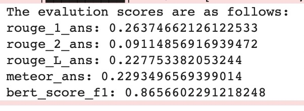
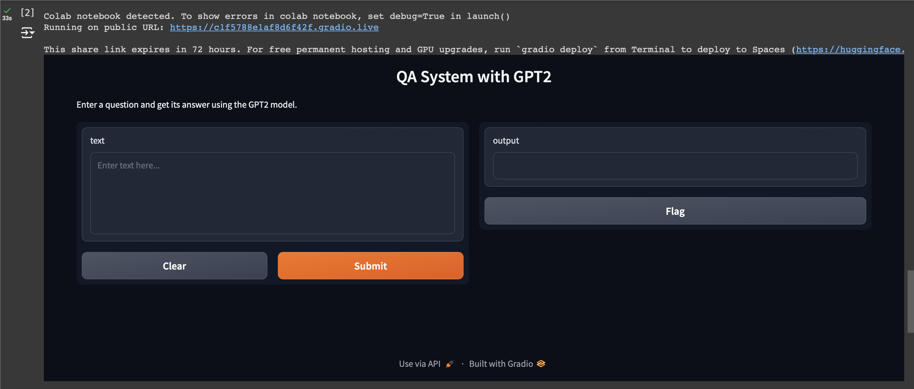
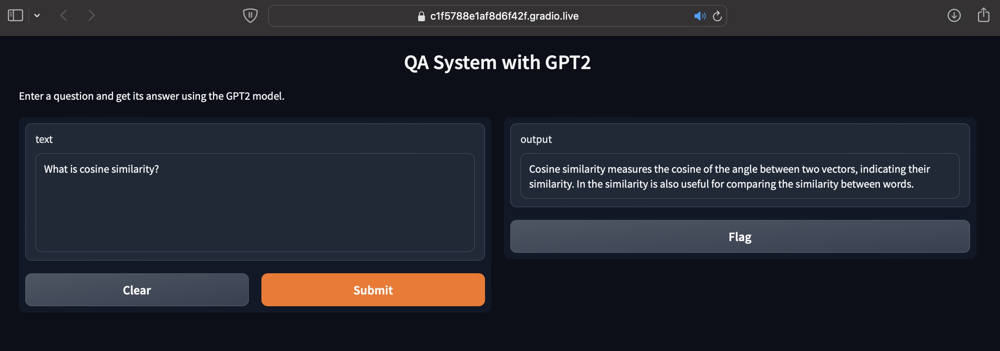
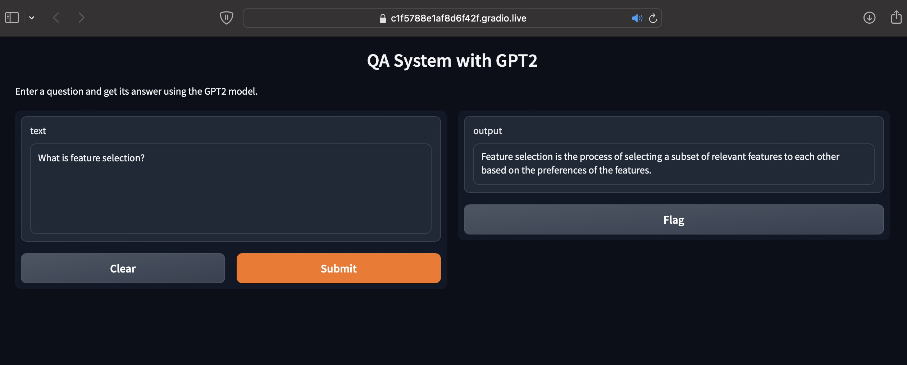
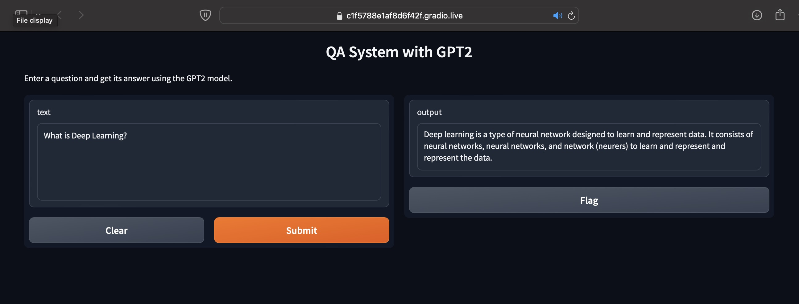

# AI Q&A Bot using Fine-tuned GPT-2

This repository contains a project for a Q&A bot that uses a fine-tuned GPT-2 model to answer questions related to artificial intelligence (AI). The model is trained and deployed on Google Colab, leveraging free resources for both training and inference. The deployment is handled via a Gradio API for an interactive interface.

## Table of Contents
- [Project Overview](#project-overview)
- [Features](#features)
- [Installation](#installation)
- [Usage](#usage)
  - [Training the GPT-2 Model](#training-the-gpt-2-model)
  - [Deploying the Model with Gradio](#deploying-the-model-with-gradio)
- [Metrics](#metrics)
- [Outcomes](#outcomes)
- [Customization](#customization)
- [Contributing](#contributing)
- [License](#license)

## Project Overview
This project involves two key components:
1. **Fine-tuning GPT-2**: The GPT-2 model has been fine-tuned on a dataset of AI-related questions and answers. The model is trained on Google Colab using the T5 GPU for optimal performance.
2. **Gradio Deployment**: The model is deployed using the Gradio API, providing a user-friendly web interface where users can input AI-related questions and get accurate answers.

## Features
- **Fine-tuned GPT-2 model** for AI-related Q&A tasks.
- **Colab-based Training**: Model is trained using free resources on Google Colab, enabling easy reproducibility.
- **Gradio Web Interface**: An interactive front-end interface for real-time model inference.
- **Lightweight Deployment**: Model inference is also done on Google Colab, making deployment cost-effective and scalable.

## Installation

1. **Clone the repository**:
   ```bash
   git clone https://github.com/Kethavardhan/AI-Based-Generative-QA-System/tree/master

   cd AI-Based-Generative-QA-System/QnA/
2. **Requirements**:

    You will need access to a Google Colab account.
    Install required libraries in the Colab environment:
    ```bash
    !pip install transformers gradio torch

## Usage

**Training the GPT-2 Model**:

The training process is performed on Google Colab using a T5 GPU. Follow these steps to fine-tune the GPT-2 model:

1. Open the QnA.ipynb file in Google Colab.
2. Upload your training dataset (make sure it contains AI-related Q&A pairs).
3. Run all the cells to:
   - Install the necessary libraries (transformers, torch, etc.).
   - Load and fine-tune the GPT-2 model on your dataset.
4. Once training is complete, the fine-tuned model will be saved for later deployment.


**Deploying the Model with Gradio**:

To deploy the fine-tuned model using Gradio for real-time inference:

1. Open the QnA_Gradio.ipynb file in Google Colab.
2. Ensure you have the fine-tuned GPT-2 model ready for loading.
3. Run the notebook cells to:
   - Install the necessary libraries.
   - Load the fine-tuned model.
   - Initialize the Gradio API to set up an interactive web-based Q&A interface.
4. Once deployed, you can interact with the model by inputting AI-related questions through the Gradio interface, and the model will return relevant answers.

**Metrics**:

During the training, metrics such as rouge1, rouge2, rouge_L, meteor_ans, and bert_score_f1 are logged. Here’s the snippet of the logged metrics:



### Explanation of Metrics

1. **ROUGE-1** (`rouge_1_ans: 0.2637`):
   - A score of `0.2637` indicates that around 26% of the unigrams in the generated answers are also present in the reference answers. This gives a basic idea of the word-level similarity between the responses.

2. **ROUGE-2** (`rouge_2_ans: 0.0911`):
   - With a score of `0.0911`, this suggests that approximately 9% of the bigrams are shared, reflecting how well the model captures short multi-word sequences from the reference answers.

3. **ROUGE-L** (`rouge_L_ans: 0.2278`):
   - ROUGE-L focuses on the longest common subsequence (LCS) between the generated and reference answers.
   - A score of `0.2278` means that around 23% of the longest word sequences from the reference answers appear in the generated answers, showing how well the model maintains the structural flow of the content.

4. **METEOR** (`meteor_ans: 0.2293`):
   - The score of `0.2293` reflects the balance between precision and recall, with consideration for synonyms and exact matches. This metric helps capture semantic similarity beyond exact word overlap.

5. **BERTScore F1** (`bert_score_f1: 0.8657`):
   - A high score of `0.8657` indicates that the generated answers are highly semantically similar to the reference answers. This metric is particularly useful because it assesses meaning rather than just surface-level word matching.

### Summary of Results

- The **ROUGE** scores show that the model captures some degree of word overlap and sequence structure but has room for improvement in capturing multi-word phrases (evidenced by the lower ROUGE-2 score).
- The **METEOR** score demonstrates that the model balances precision and recall, while also recognizing synonyms and stemming.
- The **BERTScore F1** is very high, suggesting that while the model may not always produce exact word matches, it does generate answers that are semantically close to the reference answers, indicating strong understanding and relevance.

These evaluation metrics indicate that the fine-tuned GPT-2 model is performing well in generating relevant and contextually appropriate AI-related answers.




**Outcomes**







**Customization**
- **Training Data**: You can modify the dataset used for fine-tuning to cover additional topics or specialize the model further.
- **Gradio Interface**: The Gradio API offers customization options for the interface, allowing you to adjust the look and feel or functionality to suit your needs.

**Next Steps**

After training and deploying the model, you can further improve the system by:

- Training on more diverse datasets.
- Fine-tuning different GPT models (e.g., GPT-3, T5).
- Enhancing the Gradio interface with additional features (e.g., multiple input formats).
